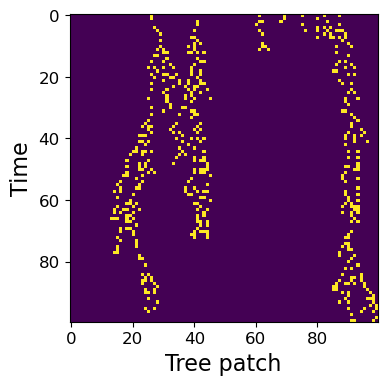

# A new framework for assessing the extinction risk of plant metapopulations in urban tree bases

  

This repository hosts the various codes used in the paper of the same name. It is structured as follows:

- The `src` folder contains the main code to manipulate and estimate the model proposed in the paper.

- The `code_application_dataset_urban_tree_bases` contains scripts to run the main code on the *Paris 12* data set.

- The `code_figures` folder contains code to reproduce the figures for experiments on the *Paris 12* data set.

- The `code_statistical_tests_biological_traits` contains the test procedures for the association between the plant species extinction risk and biological traits of the species.

- The `code_synthetic_data` contains various scripts to generate synthetic data and reproduce the experiments in the paper.

Additionally:

- The file `run_estimation.py` provides a minimal script running on the synthetic data set `data.csv`. It can be used as a starting point to run the code on new data sets.

- The Jupyter notebook `Demo.ipynb` provides a more detailed walkthrough of the main functions of the code.